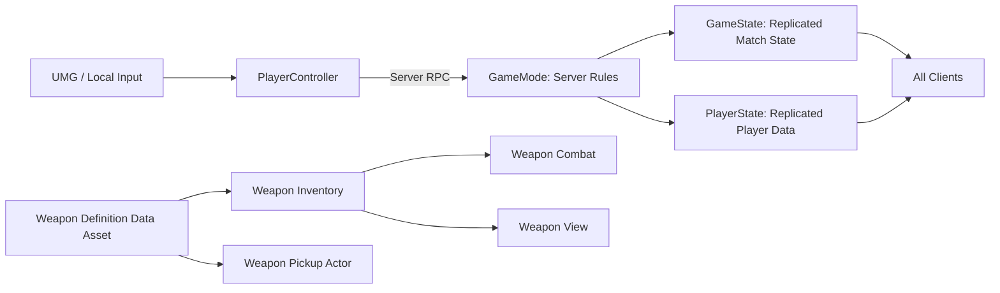

# MyFps

[English](README.md) | [简体中文](README_zh-CN.md)

`MyFps` is a UE 5.5 multiplayer FPS deathmatch demo built as a client-programmer portfolio project. It focuses on server-authoritative combat, a data-driven weapon system, first-person and third-person presentation separation, and a complete match loop.

## Highlights

- Server-authoritative hitscan combat using a dedicated `BulletTrace` channel.
- Replicated health, death, score, ready state, kill feed, and match state.
- Data-driven weapons based on `UMyFpsWeaponDefinition` Primary Data Assets.
- Split weapon responsibilities: inventory state, combat rules, local/remote view meshes, and world pickups.
- First-person and third-person weapon mounting, montage playback, reload layering, and basic turn-in-place support.
- Weapon pickup, replacement, drop physics, outline highlighting, and world-space pickup prompts.
- Hit marker, kill marker, hit sound, directional damage ring, and Niagara tracer feedback.
- Automatic/manual respawn, match result UI, ready flow, and automatic next-round restart.
- Main menu with single-player, LAN Host/Join, local display-name settings, and host-only Start/End Game controls.

## Architecture



### Runtime responsibilities

| Layer | Responsibility |
| --- | --- |
| `GameInstance` | Local settings, saved display name, last LAN address, host settings, map-travel flags, local host-control widget. It is not replicated. |
| `GameMode` | Server-only authority for match start/end, score, damage consequences, respawn, starting weapons, and client removal. |
| `GameState` | Replicated global match state: match started/finished, target score, winner, ready count, and the latest kill-feed messages. |
| `PlayerState` | Replicated per-player state: player name, score, kills, deaths, and ready status. |
| `PlayerController` | Local input/cursor state and client/server RPC boundaries. |

## Combat Flow

```text
Local fire input
  -> Server RPC
  -> Server BulletTrace from camera view
  -> Ignore shooter and equipped weapon
  -> ApplyDamage / score / death on server
  -> Replicate persistent state through GameState and PlayerState
  -> Send local-only hit feedback to the shooter
  -> Spawn tracer as visual feedback only
```

The Niagara tracer is cosmetic. It does not decide hits, damage, score, or death.

## Weapon System

The old monolithic weapon component was replaced with a data-driven split:

| Module | Responsibility |
| --- | --- |
| `UMyFpsWeaponDefinition` | Static weapon data: meshes, ammo, rate of fire, montages, Niagara, sounds, and timing. |
| `UMyFpsWeaponInventoryComponent` | Replicated equipped-weapon and ammo state. |
| `UMyFpsWeaponCombatComponent` | Server firing, hitscan, damage, reload, ammo, and tracer dispatch. |
| `UMyFpsWeaponViewComponent` | First-person and third-person weapon mesh creation, sockets, and cosmetic montage playback. |
| `AMyFpsWeaponPickupActor` | Replicated world pickup, prompt, outline, drop physics, and pickup interaction. |

## Menu and LAN Flow

The main menu uses one root widget and a `WidgetSwitcher`:

```text
Main Page
  -> Single Player
  -> Multiplayer
       -> Host Settings -> OpenLevel(GameplayMap?listen)
       -> Join Page -> ClientTravel(IP:7777)
  -> Settings -> local player display name
  -> Quit
```

Only the listen-server host can open the in-game host-control panel with `F6`.

- `Start Game`: starts the server match and hides the panel.
- `End Game`: stops the match, returns remote clients to the main menu, and restores the host to a pre-match state.

## Build and Run

### Requirements

- Unreal Engine 5.5
- Visual Studio 2022 with C++ desktop development tools
- Windows 10 or Windows 11

Open `MyFps.uproject` with UE 5.5, or build the editor target with:

```powershell
& 'G:\project\MyFps_UE5.4\Source\MyFps\BuildMyFps.bat'
```

### Local two-process LAN test

Launch two independent game processes from PowerShell:

```powershell
$UE = "G:\UE_5.5\Engine\Binaries\Win64\UnrealEditor.exe"
$Project = "G:\project\MyFps_UE5.4\MyFps.uproject"

Start-Process -FilePath $UE -ArgumentList "`"$Project`" -game -windowed -ResX=1280 -ResY=720"
Start-Process -FilePath $UE -ArgumentList "`"$Project`" -game -windowed -ResX=1280 -ResY=720"
```

1. In process A: `Multiplayer -> Host Game -> Start Host`.
2. In process B: `Multiplayer -> Join Game`, then join `127.0.0.1`.
3. The host presses `F6`, then selects `Start Game`.

For a real LAN test, join the host machine's IPv4 address and allow UDP port `7777` through the firewall.

## Current Validation

The core match loop has been tested in PIE and in two independent `-game` processes:

- Host/Join connection flow.
- Display-name replication, scoreboard, and kill feed.
- Start/End Game host controls.
- Bidirectional damage, death, respawn, scoring, match result, Ready, and next-round restart.
- Weapon pickup, drop, reload, and visual feedback.

## Roadmap

- Add password validation in `GameMode::PreLogin`.
- Enforce maximum player count on the server.
- Add an in-game lobby/player list and Join failure feedback.
- Add a second distinct weapon to demonstrate framework reuse.
- Add Physical Material / Surface Type impact feedback.
- Capture Unreal Insights performance evidence and publish a demo video.

## Notes

This repository is an active development project. Build artifacts, Saved data, local documentation, and local scripts are intentionally excluded from version control.
